# 🚲 Bicycle Shop API

## 📌 Про проєкт
RESTful Web API застосунок для e-commerce платформи (ніша: Вело-магазин), розроблений в рамках Практичної роботи №1. Система дозволяє управляти каталогом товарів (велосипедів та аксесуарів) та обробляти замовлення клієнтів.

**Розробник:** Розум Артем Олегович, група М-F2-25-1-ПІ.

## 🏗 Архітектура та Патерни
Проєкт побудовано з використанням класичних архітектурних принципів та підходів:
*   **Шарова архітектура (Layered Architecture):** Суворе розділення на Domain, Data, Application та API шари.
*   **Repository Pattern:** Для абстрагування логіки доступу до бази даних.
*   **Service Layer Pattern:** Для інкапсуляції бізнес-логіки та відділення її від контролерів.
*   **DTO (Data Transfer Objects):** Для безпечного обміну даними між клієнтом та сервером.
*   **Принципи SOLID & Dependency Injection:** Впровадження залежностей через конструктори класів.

## 🛠 Технологічний стек
*   **Платформа:** .NET 10 SDK
*   **Фреймворк:** ASP.NET Core Web API
*   **База даних:** PostgreSQL
*   **ORM:** Entity Framework Core (Code-First підхід)
*   **Валідація:** FluentValidation
*   **Документація API:** Swagger / OpenAPI

## 🚀 Функціонал (Доменні сутності)
У проєкті реалізовано наступні доменні сутності:
1.  **Product (Товар):** Повний CRUD (Створення, читання, оновлення, видалення).
2.  **Catalog (Каталог):** Базові операції читання та створення.
3.  **Customer (Клієнт):** Базові операції.
4.  **Order (Замовлення):** Базові операції.

---

## 📸 Демонстрація роботи 2 (Скріншоти)

### 1. Загальний інтерфейс Swagger UI
Тут представлені всі реалізовані кінцеві точки (endpoints) для керування сутностями.
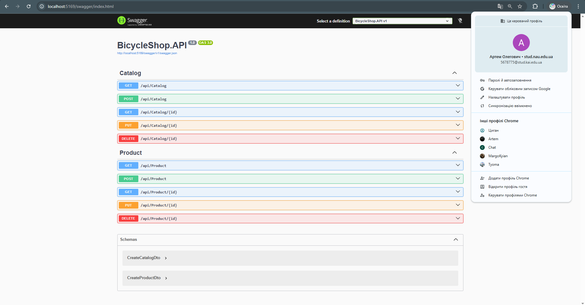

### 2. Створення нової категорії (POST /api/Catalog)
Успішне створення каталогу "Гірські велосипеди" зі статусом 201 Created.
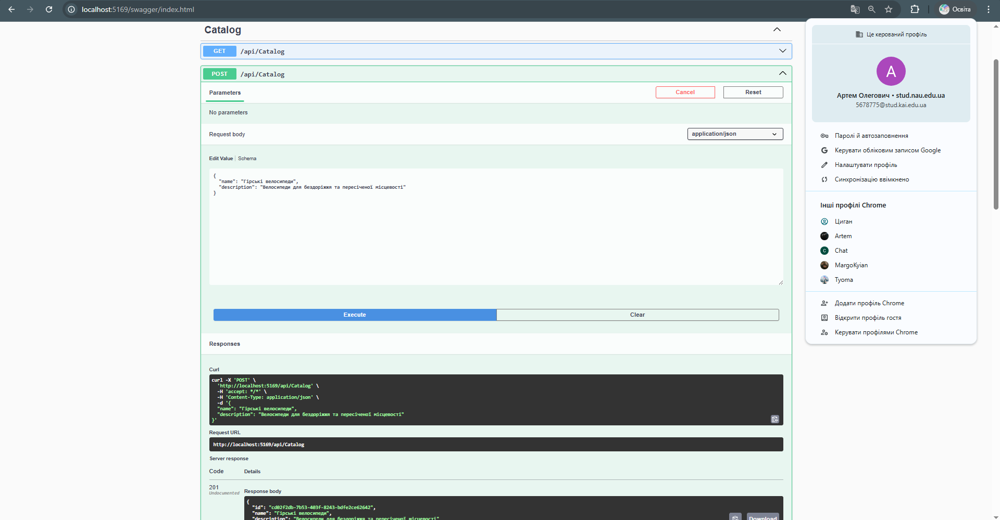

### 3. Створення нового товару (POST /api/Product)
Успішне створення продукту "Trek Marlin 7" зі статусом 201 Created.
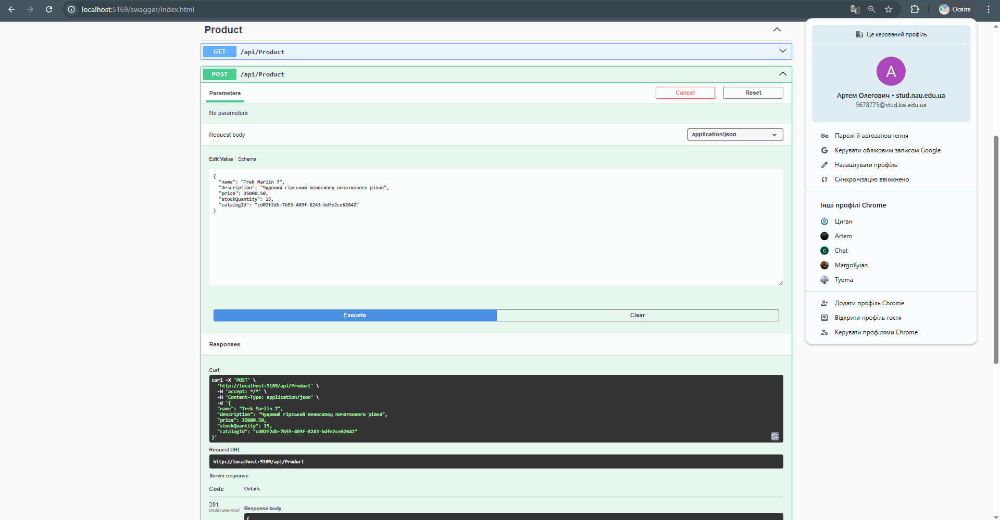

### 4. Додавання товару та FluentValidation (400 Bad Request)
Демонстрація роботи валідатора: система відхиляє запит, якщо ціна менша за нуль, а назва порожня.
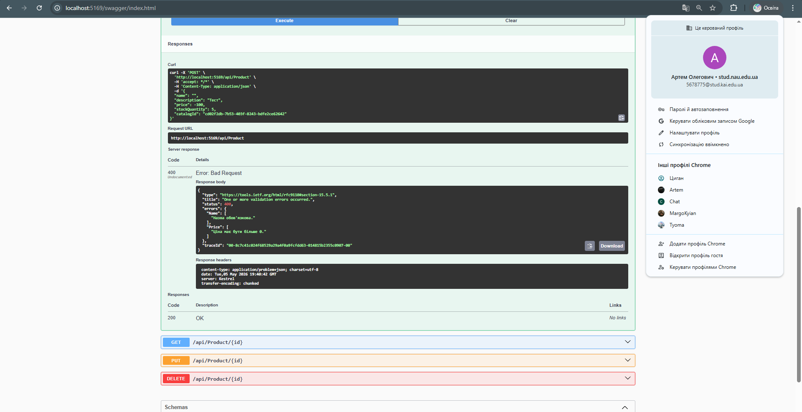

### 5. Отримання списку товарів (GET /api/Product)
Успішне повернення масиву об'єктів (DTO) зі статусом 200 OK.
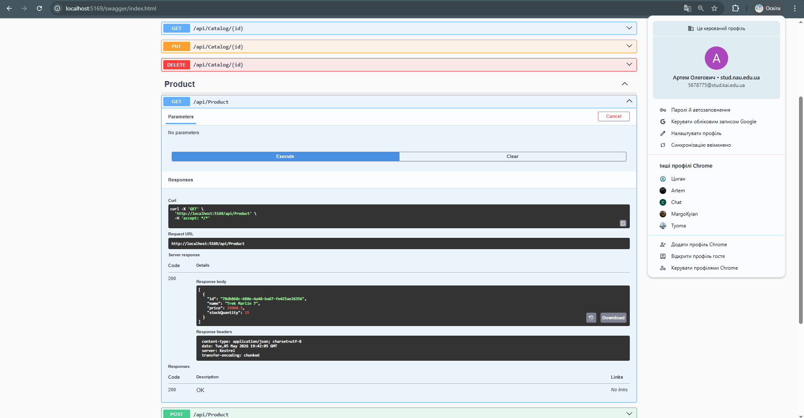

---

## 📸 Демонстрація роботи 3 (Скріншоти)

### 1. Загальні зміни в інтерфейсі Swagger UI (1)
Тут представлені всі реалізовані кінцеві точки (endpoints) для керування сутностями.
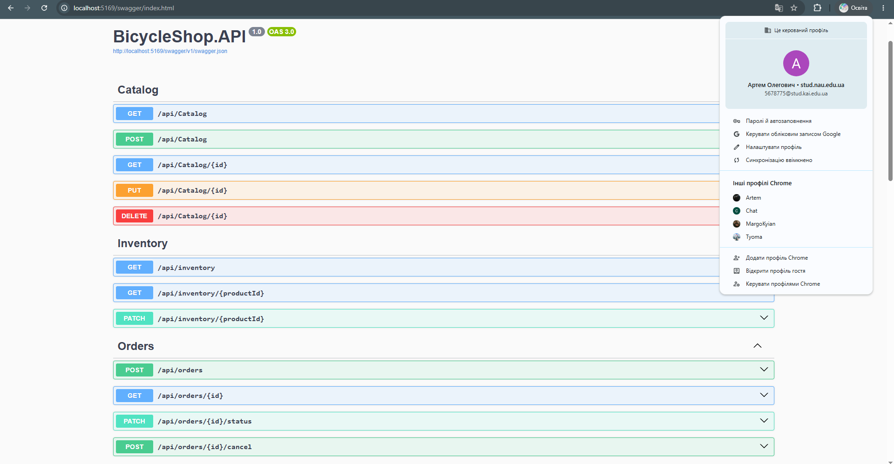

### 2. Загальні зміни в інтерфейсі Swagger UI (2)
Тут представлені всі реалізовані кінцеві точки (endpoints) для керування сутностями (ПРОДОВЖЕННЯ).
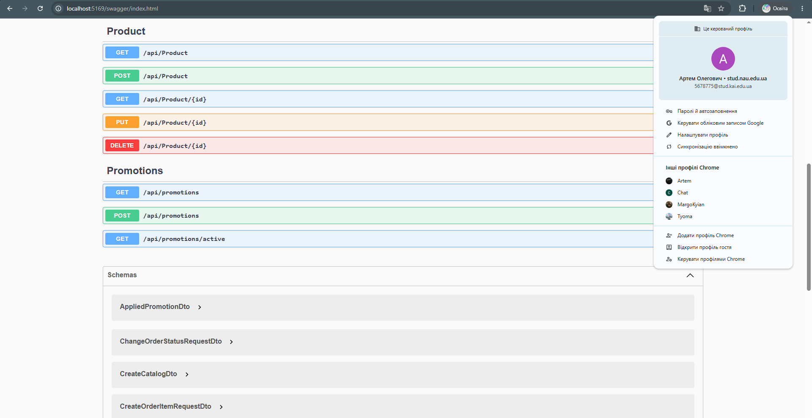

### 3. Представлення схеми в інтерфейсі Swagger UI
Візуальне представлення схеми в інтерфейсі Swagger UI.
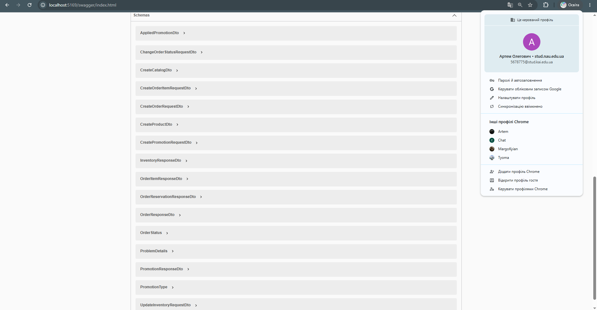

### 4. Приклади реалізованого Promotions (Unit-tests) (1)
Демонстрація роботи промо-акцій: використання юніт-тестів.
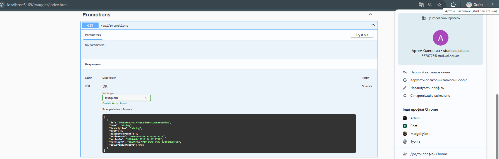

### 5. Приклади реалізованого Promotions (Unit-tests) (2)
Демонстрація роботи промо-акцій: використання юніт-тестів.
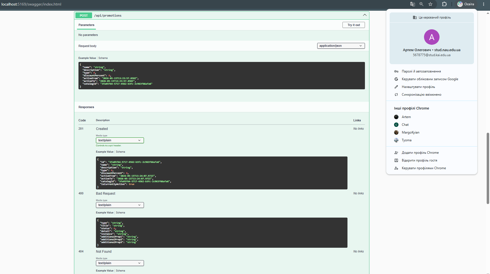

### 6. Приклади реалізованого Promotions (Unit-tests) (3)
Демонстрація роботи промо-акцій: використання юніт-тестів.
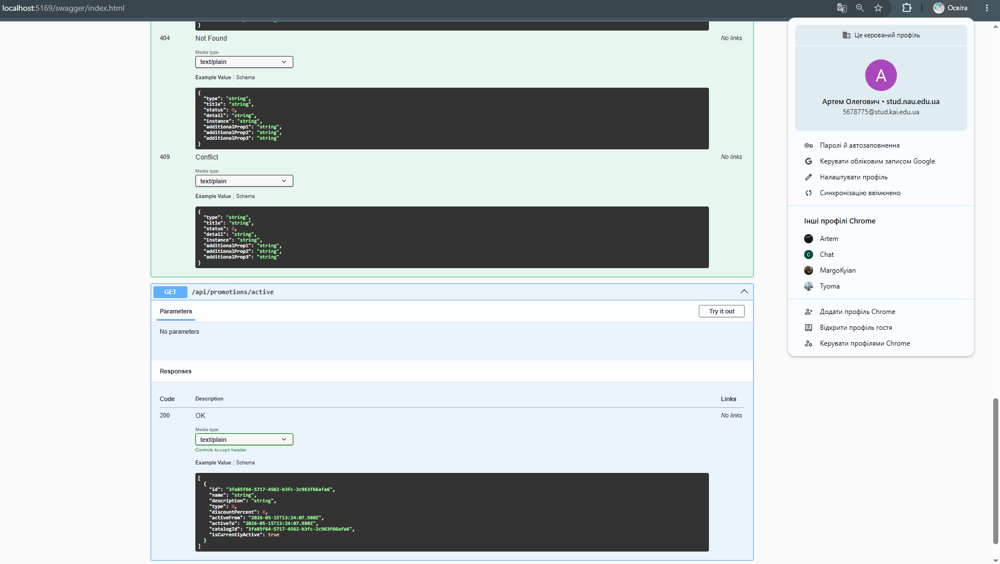

---